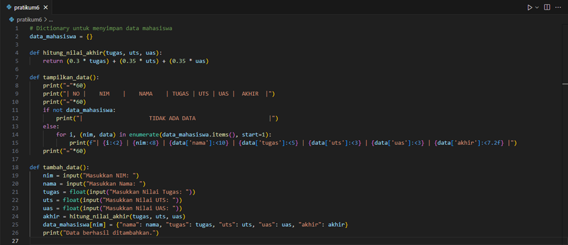

# Program sederhana menampilkan daftar nilai mahasiswa menggunakan Dictionary
### Contoh Input Program Python3 (Vs code)

#### Penjelasan program:
1.	Struktur Data yang Digunakan
     *	Dictionary:
         -	Digunakan untuk menyimpan data mahasiswa.
         -	Key: NIM (Nomor Induk Mahasiswa) → Unik untuk setiap mahasiswa.
         -	Value: Dictionary lain yang berisi informasi mahasiswa, yaitu:
             - nama → Nama mahasiswa.
             - tugas → Nilai tugas.
             - uts → Nilai UTS.
             - uas → Nilai UAS.
             - akhir → Nilai akhir yang dihitung secara otomatis.
2.	Fungsi-Fungsi Program
     * hitung_nilai_akhir
         * Fungsi ini digunakan untuk menghitung nilai akhir mahasiswa berdasarkan bobot:
             -	Tugas: 30%
             -	UTS: 35%
             -	UAS: 35%
         * Rumus:
             '''
             return (0.3 * tugas) + (0.35 * uts) + (0.35 * uas)
             '''
     *	tampilkan_data
         -	Menampilkan semua data mahasiswa dalam format tabel.
         -	Jika tidak ada data, program menampilkan pesan "Tidak ada data."
     *	tambah_data
         -	Fungsi ini meminta pengguna untuk memasukkan data baru, yaitu:
             -	NIM, Nama, Nilai Tugas, Nilai UTS, Nilai UAS.
         -	Fungsi menghitung nilai akhir mahasiswa menggunakan hitung_nilai_akhir dan menambahkan data ke dictionary data_mahasiswa.
     *	ubah_data
         -	Fungsi ini memungkinkan pengguna untuk memperbarui data mahasiswa berdasarkan NIM.
         -	Jika NIM ditemukan, data yang sudah ada diperbarui dengan data baru.
         -	Jika NIM tidak ditemukan, program menampilkan pesan "Data tidak ditemukan."
     *	hapus_data
         -	Fungsi ini digunakan untuk menghapus data mahasiswa berdasarkan NIM.
         -	Jika NIM ditemukan, data akan dihapus dari dictionary.
         -	Jika NIM tidak ditemukan, program menampilkan pesan "Data tidak ditemukan."
     *	cari_data
         -	Fungsi ini mencari data mahasiswa berdasarkan NIM.
         -	Jika ditemukan, informasi lengkap mahasiswa ditampilkan, seperti nama, tugas, UTS, UAS, dan nilai akhir.
         -	Jika tidak ditemukan, program menampilkan pesan "Data tidak ditemukan."
3.	Alur Utama Program
     *	Tampilan Menu Horizontal: Menu ditampilkan dalam satu baris untuk memudahkan pengguna:
         Menu: [T]ambah Data  |  [U]bah Data  |  [H]apus Data  |  [L]ihat Data  |  [C]ari Data  |  [K]eluar
         Pengguna memilih menu dengan memasukkan huruf awal pilihan (contoh: T untuk Tambah Data).
     *	Operasi Berdasarkan Pilihan:
         -	T: Menjalankan fungsi tambah_data untuk menambahkan data.
         -	U: Menjalankan fungsi ubah_data untuk mengubah data.
         -	H: Menjalankan fungsi hapus_data untuk menghapus data.
         -	L: Menjalankan fungsi tampilkan_data untuk melihat semua data.
         -	C: Menjalankan fungsi cari_data untuk mencari data mahasiswa tertentu.
         -	K: Keluar dari program.
     *	Looping:
         -	Program berjalan dalam loop hingga pengguna memilih K untuk keluar.

### Contoh Output penggunaan
1. [T]ambah Data
     * Menu ini digunakan untuk menambahkan data mahasiswa baru.
     * Langkah-langkah:
         - Pilih menu dengan mengetik t atau T, lalu tekan Enter.
         - Masukkan NIM mahasiswa (contoh: 20211001).
         - Masukkan Nama mahasiswa (contoh: Andi).
         - Masukkan Nilai Tugas, UTS, dan UAS (contoh: 80, 85, dan 90).
         - Data akan disimpan, dan pesan "Data berhasil ditambahkan." akan muncul.

## Flowchart

#### Penjelasan:

1. Mulai Program
     - Inisialisasi dictionary data_mahasiswa.
2. Tampilkan Menu
     - Menampilkan daftar pilihan (Tambah, Ubah, Hapus, Lihat, Cari, Keluar).
3. Input Pilihan
     - Ambil input pengguna untuk memilih menu.
4. Proses Berdasarkan Pilihan:
     - Tambah Data: Input NIM, Nama, Tugas, UTS, UAS → Hitung nilai akhir → Simpan ke dictionary.
     - Ubah Data: Input NIM → Jika ditemukan, ubah data sesuai input baru.
     - Hapus Data: Input NIM → Jika ditemukan, hapus data.
     - Lihat Data: Cetak semua data mahasiswa dalam bentuk tabel.
     - Cari Data: Input NIM → Jika ditemukan, tampilkan detail data.
     - Keluar: Akhiri program.
5. Kembali ke Menu (jika belum keluar).
6. Selesai

## latihan1

#### Penjelasan:
1. Membuat Dictionary: Dictionary kontak dibuat dengan nama sebagai key dan nomor telepon sebagai value.
2. Menampilkan Kontak Ari: Akses key "Ari" untuk mendapatkan nomor teleponnya.
3. Menambah Kontak: Tambahkan entry baru ke dictionary dengan key "Riko".
4. Mengubah Nomor Dina: Update nilai key "Dina".
5. Menampilkan Semua Nama dan Nomor: Gunakan keys(), values(), dan items() untuk menampilkan daftar nama, nomor, dan pasangan nama-nomor.
6. Menghapus Kontak Dina: Gunakan del untuk menghapus key "Dina" dari dictionary.