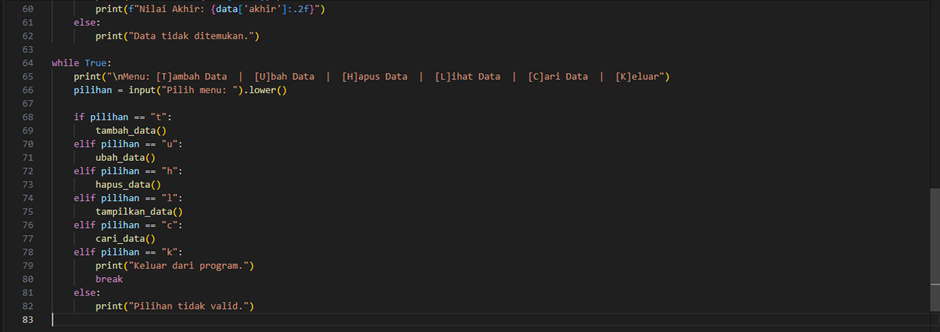

# Program sederhana menampilkan daftar nilai mahasiswa menggunakan Dictionary
### Contoh Input Program Python3 (Vs code)

#### Penjelasan program:
1.	Struktur Data yang Digunakan
     •	Dictionary:
         o	Digunakan untuk menyimpan data mahasiswa.
         o	Key: NIM (Nomor Induk Mahasiswa) → Unik untuk setiap mahasiswa.
         o	Value: Dictionary lain yang berisi informasi mahasiswa, yaitu:
             - nama → Nama mahasiswa.
             - tugas → Nilai tugas.
             - uts → Nilai UTS.
             - uas → Nilai UAS.
             - akhir → Nilai akhir yang dihitung secara otomatis.
2.	Fungsi-Fungsi Program
     a.	hitung_nilai_akhir
         •	Fungsi ini digunakan untuk menghitung nilai akhir mahasiswa berdasarkan bobot:
             o	Tugas: 30%
             o	UTS: 35%
             o	UAS: 35%
         •	Rumus:
             return (0.3 * tugas) + (0.35 * uts) + (0.35 * uas)
     b.	tampilkan_data
         •	Menampilkan semua data mahasiswa dalam format tabel.
         •	Jika tidak ada data, program menampilkan pesan "Tidak ada data."
     c.	tambah_data
         •	Fungsi ini meminta pengguna untuk memasukkan data baru, yaitu:
             o	NIM, Nama, Nilai Tugas, Nilai UTS, Nilai UAS.
         •	Fungsi menghitung nilai akhir mahasiswa menggunakan hitung_nilai_akhir dan menambahkan data ke dictionary data_mahasiswa.
     d.	ubah_data
         •	Fungsi ini memungkinkan pengguna untuk memperbarui data mahasiswa berdasarkan NIM.
         •	Jika NIM ditemukan, data yang sudah ada diperbarui dengan data baru.
         •	Jika NIM tidak ditemukan, program menampilkan pesan "Data tidak ditemukan."
     e.	hapus_data
         •	Fungsi ini digunakan untuk menghapus data mahasiswa berdasarkan NIM.
         •	Jika NIM ditemukan, data akan dihapus dari dictionary.
         •	Jika NIM tidak ditemukan, program menampilkan pesan "Data tidak ditemukan."
     f.	cari_data
         •	Fungsi ini mencari data mahasiswa berdasarkan NIM.
         •	Jika ditemukan, informasi lengkap mahasiswa ditampilkan, seperti nama, tugas, UTS, UAS, dan nilai akhir.
         •	Jika tidak ditemukan, program menampilkan pesan "Data tidak ditemukan."
3.	Alur Utama Program
     a.	Tampilan Menu Horizontal: Menu ditampilkan dalam satu baris untuk memudahkan pengguna:
         Menu: [T]ambah Data  |  [U]bah Data  |  [H]apus Data  |  [L]ihat Data  |  [C]ari Data  |  [K]eluar
         Pengguna memilih menu dengan memasukkan huruf awal pilihan (contoh: T untuk Tambah Data).
     b.	Operasi Berdasarkan Pilihan:
         o	T: Menjalankan fungsi tambah_data untuk menambahkan data.
         o	U: Menjalankan fungsi ubah_data untuk mengubah data.
         o	H: Menjalankan fungsi hapus_data untuk menghapus data.
         o	L: Menjalankan fungsi tampilkan_data untuk melihat semua data.
         o	C: Menjalankan fungsi cari_data untuk mencari data mahasiswa tertentu.
         o	K: Keluar dari program.
     c.	Looping:
         o	Program berjalan dalam loop hingga pengguna memilih K untuk keluar.
